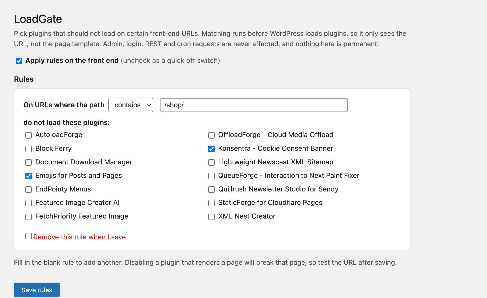

# LoadGate Forge

  
  
  
  
  
  

  <b>Stop plugins from loading where they aren't needed.</b> 
  Pick a URL, pick the plugins to skip there, and LoadGate Forge keeps their code off that request. Reversible, and the admin is never affected.

---

## The idea

Most sites carry a few plugins that only matter on one or two pages: a form builder on the contact page, a gallery on the portfolio, a chat widget on the homepage. WordPress still loads every active plugin on every request, so all that code runs on pages that never use it.

LoadGate Forge lets you say "don't load this plugin on these URLs." On a matching request the plugin is taken out of the active list before it loads, so its PHP never runs there. Everywhere else, it works exactly as before.

## How it works (and an honest limit)

To stop a plugin from loading, the decision has to be made *before* WordPress loads plugins, through the `option_active_plugins` filter. Only a **must-use plugin** runs early enough for that, so LoadGate Forge installs a small loader into `wp-content/mu-plugins/` on activation and removes it on deactivation.

Because that runs before WordPress knows which page you asked for, **matching is by request URL, not by `is_page()` or block content.** There's no way around that at plugin-load time, so LoadGate Forge is honest about it: rules match the URL path.

## Safety

The loader bails out completely for anything that isn't a plain front-end page view:

| Never affected |
|---|
| The admin area (`/wp-admin/`) |
| The login screen |
| REST API calls (`/wp-json/`) |
| Cron and WP-CLI |
| Any non-GET request |

So even a rule that matches everything can't touch your dashboard, and LoadGate Forge never disables itself. There's also a master switch to turn every rule off at once, and clearing a rule restores normal loading. Nothing is ever deleted.

## Installation

**From your dashboard**

1. Download this repository as a ZIP.
2. **Plugins → Add New → Upload Plugin**, choose the ZIP, install and activate.

**Manually**

1. Copy the `loadgateforge` folder into `wp-content/plugins/`.
2. Activate **LoadGate Forge**.

Either way, activation installs the loader into `wp-content/mu-plugins/`. Then open **Settings → LoadGate Forge**.

## How to use it

1. Open **Settings → LoadGate Forge**.
2. In the blank rule, choose how to match (contains / starts with / is exactly) and type the URL path, for example `/contact/`.
3. Tick the plugins that should not load on that URL.
4. Save. Fill in the next blank rule to add another.
5. Visit the URL and check the page still works. To undo, tick "Remove this rule" and save, or use the master switch.

> Disabling a plugin that actually renders a page will break that page. Always test the URL after saving.

## Requirements

- WordPress 6.3 or newer
- PHP 7.4 or newer
- `wp-content/mu-plugins/` writable (created automatically if missing)
- Single-site installs (multisite not supported yet)

## Screenshot

## Support

Useful to you? You can [buy me a coffee on Ko-fi](https://ko-fi.com/gunjanjaswal).

Bug or idea? Open an issue, or email [hello@gunjanjaswal.me](mailto:hello@gunjanjaswal.me).

## Author

**Gunjan Jaswal**

- Website: [gunjanjaswal.me](https://www.gunjanjaswal.me)
- Email: [hello@gunjanjaswal.me](mailto:hello@gunjanjaswal.me)
- Ko-fi: [ko-fi.com/gunjanjaswal](https://ko-fi.com/gunjanjaswal)

## License

Released under the [GPLv2 or later](https://www.gnu.org/licenses/gpl-2.0.html).
